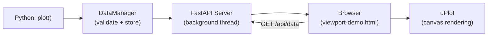
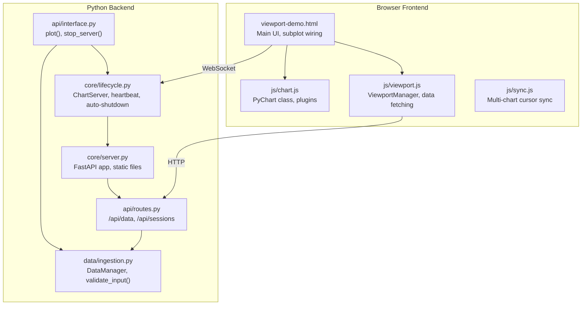
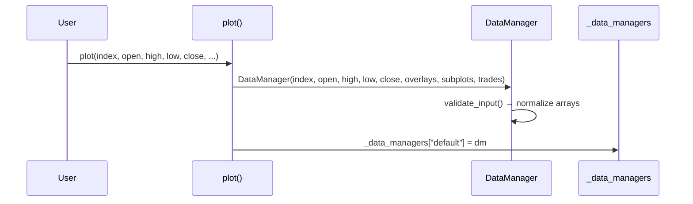
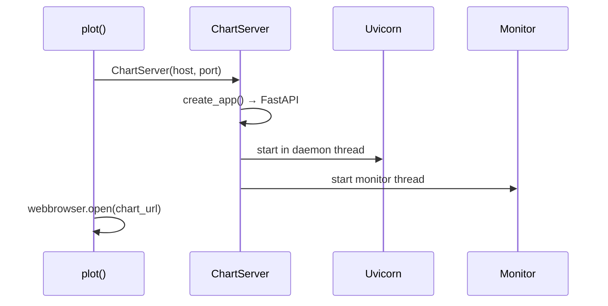
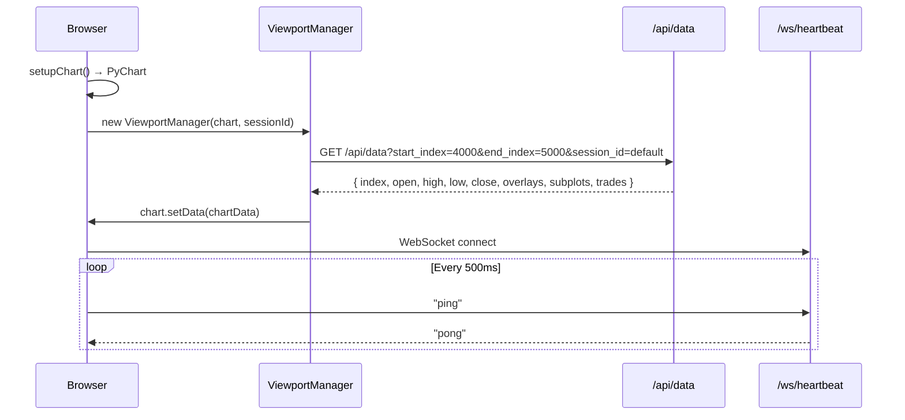
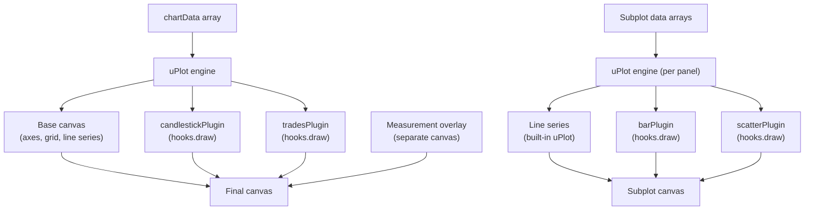
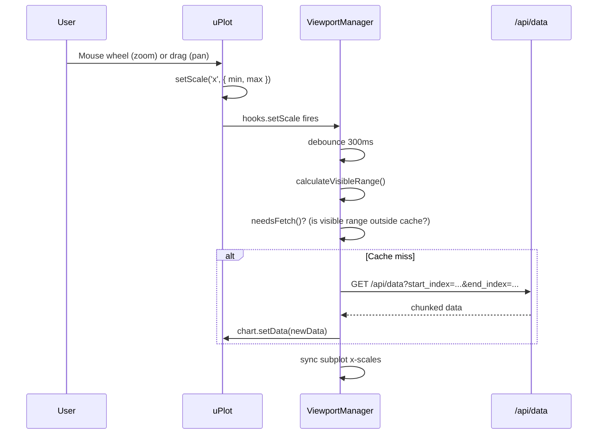
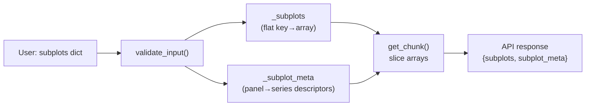
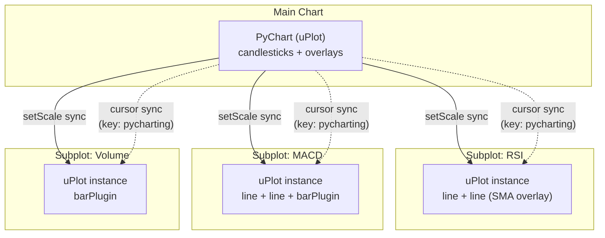
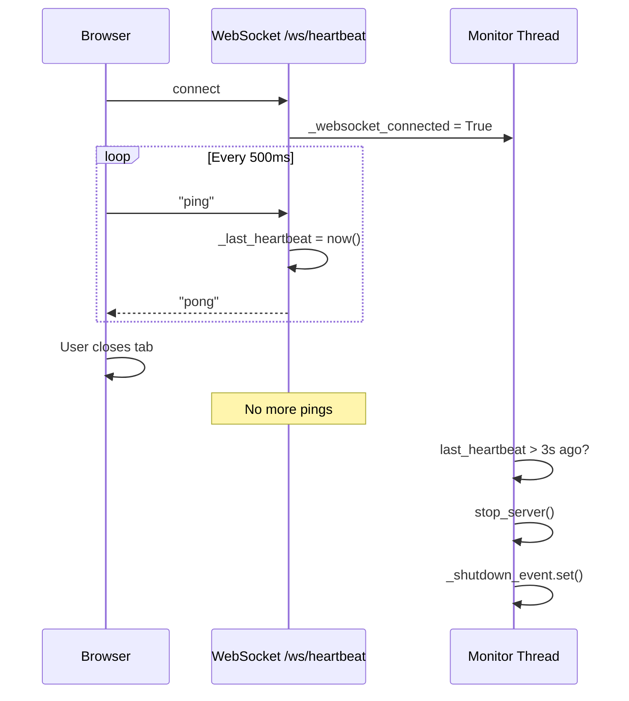

# How PyCharting Works

A deep dive into the internals — from a single `plot()` call in Python to an interactive chart in your browser.

---

## Architecture Overview

PyCharting is a local-server charting library. When you call `plot()`, it:

1. Validates and stores your data in memory.
2. Starts a FastAPI server on a background thread.
3. Opens a browser page that fetches data from the server and renders it with uPlot.



---

## Component Map



---

## Data Flow: End to End

### Step 1 — Python ingestion

When you call:

```python
plot(index, open=o, high=h, low=l, close=c, overlays=overlays, subplots=subplots, trades=trades)
```

The function in `api/interface.py`:

1. Converts any `list` inputs to `numpy` arrays.
2. Creates a `DataManager` which calls `validate_input()`:
   - Checks all arrays are the same length.
   - Normalizes OHLC (auto-fills missing series from what's provided).
   - Validates `trades` contains only `-1`, `0`, `1`.
   - Converts everything to `numpy` arrays.
3. Stores the `DataManager` in the global session registry (`_data_managers[session_id]`).



### Step 2 — Server startup

If no server is running, `plot()` creates a `ChartServer`:

1. `create_app()` builds the FastAPI application:
   - Mounts `/static` serving the HTML/JS frontend.
   - Registers the API router at `/api`.
   - Adds a WebSocket endpoint at `/ws/heartbeat`.
2. Starts Uvicorn in a daemon thread.
3. Starts a monitor thread for heartbeat-based auto-shutdown.



### Step 3 — Browser loads the page

The browser opens `viewport-demo.html?session=default`. On load:

1. Creates a `PyChart` instance (uPlot wrapper).
2. Creates a `ViewportManager` that knows the session ID.
3. Calls `loadInitialData()` — fetches the **last 1000 points** from the API.
4. Opens a WebSocket to `/ws/heartbeat` and pings every 500ms.



### Step 4 — Data chunking and slicing

The backend never sends the full dataset at once. The API accepts `start_index` and `end_index` (integer positions) and returns a slice:

```python
def get_chunk(self, start_index, end_index):
    # Clamp to valid range
    start_index = max(0, min(start_index, self._length))
    end_index = max(start_index, min(end_index, self._length))

    # Slice every array (including flattened multi-series subplot keys)
    return {
        "index": self._index[start:end],      # converted to Unix ms if datetime
        "open":  self._open[start:end],
        "high":  self._high[start:end],
        "low":   self._low[start:end],
        "close": self._close[start:end],
        "overlays":    { name: arr[start:end] for each overlay },
        "subplots":    { name: arr[start:end] for each subplot key },
        "subplot_meta": self._subplot_meta,    # panel layout descriptors
        "trades":      self._trades[start:end],   # if present
    }
```

Datetime indices (`datetime64`, `pd.Timestamp`) are converted to Unix milliseconds so JavaScript can work with them directly.

### Step 5 — Chart rendering

`ViewportManager.updateChartData()` transforms the API response into uPlot's data format:

```
chartData = [
    xValues,        // data.index (actual timestamps or numeric values)
    open,           // OHLC arrays
    high,
    low,
    close,
    ...overlays     // one array per overlay
]
```

This is passed to `PyChart.setData()`, which creates a uPlot instance with the configured plugins.

---

## Rendering Pipeline



### Candlestick Plugin

Draws candles in the uPlot `draw` hook:

- Gets visible range from `u.series[0].idxs` → `[iMin, iMax]`.
- For each bar: maps OHLC values to pixel positions via `u.valToPos()`.
- Draws the **wick** (high→low vertical line) and **body** (open→close filled rect).
- Colors: `#26a69a` (green, close ≥ open) / `#ef5350` (red, close < open).
- Candle width adapts to zoom: `(availableWidth / numCandles) * 0.7`.

### Trades Plugin

Draws buy/sell arrows in the same `draw` hook:

- Reads `this.trades` array (set via `setTrades()`).
- For each visible bar with a non-zero signal:
  - **Buy (+1)**: green up-arrow below the low.
  - **Sell (−1)**: red down-arrow above the high.
- Arrow size scales with zoom level.

### Measurement Tool

A separate transparent canvas overlaid on the chart:

- Activated by holding **Shift** or clicking the 📏 button.
- Click to set start point, click again to set end point.
- Draws a dashed line between the two points.
- Shows a box with **Δ Price**, **Δ %**, and **Δ Time**.
- Coordinates are stored in data space (not pixel space), so measurements persist through zoom/pan.

---

## Zoom, Pan, and Dynamic Data Loading



**Zoom**: mouse wheel on the chart. Zooms around the cursor position by scaling the x-range by ±25%.

**Pan**: left-click drag. Shifts the x-range proportionally to cursor movement.

**calculateVisibleRange()**: the x-axis uses actual data values (timestamps or numbers). The viewport manager interpolates these back to integer positions for the API:

```javascript
const valuesPerPos = (xMax - xMin) / (posCount - 1);
visibleStart = posStart + (scaleMin - xMin) / valuesPerPos;
visibleEnd   = posStart + (scaleMax - xMin) / valuesPerPos;
```

**needsFetch()**: returns `true` if the calculated position range extends beyond the cached range. The cache stores `{ startIndex, endIndex, data }`.

---

## Subplots

Subplots are independent uPlot instances stacked below the main chart. Each gets its own wrapper div, title label, and resize handle.

### Subplot data model

The Python API accepts three formats for subplot values:

| Format | Description |
|---|---|
| `array` | Single line series (default color) |
| `{"data": array, "type": "bar"\|"scatter"\|"line", "color": "#hex"}` | Single series with type/color |
| `[{"data": array, "type": ..., "color": ..., "label": ...}, ...]` | Multi-series panel |

Internally, `validate_input()` normalizes all formats into two structures:

- **`_subplots`**: a flat dict of `name → np.ndarray`. Multi-series panels are flattened with `__` suffixes (e.g., `MACD__0`, `MACD__1`, `MACD__2`).
- **`_subplot_meta`**: a dict of `panel_name → list[{key, type, color, label}]` describing which data keys belong to each panel and how to render them.



### Rendering types

Each series within a subplot panel is rendered using one of three types:

| Type | Plugin | Rendering |
|---|---|---|
| `line` | Built-in uPlot series | Solid line with configurable stroke color |
| `bar` | `barPlugin(seriesIndices)` | Vertical bars from y=0; green (`#26a69a`) if value ≥ 0, red (`#ef5350`) if < 0 |
| `scatter` | `scatterPlugin(seriesIndices)` | Filled circles at data points with configurable color |

Bar and scatter types use a hidden uPlot series (`stroke: 'transparent'`, `paths: () => null`) so uPlot still tracks the data range for axis scaling, while the actual drawing is done by custom plugins in the `draw` hook.

### Multi-series example

A MACD panel with two lines and a histogram:

```python
"MACD": [
    {"data": macd_line,   "type": "line", "color": "#2196F3", "label": "MACD"},
    {"data": signal_line, "type": "line", "color": "#FF9800", "label": "Signal"},
    {"data": histogram,   "type": "bar",                      "label": "Histogram"},
]
```

This creates a single uPlot instance with `data = [xValues, macd, signal, hist]`, two visible line series, and a `barPlugin` drawing the histogram from the third data array.

### Panel layout



**X-axis sync** works two ways:

1. **Scale sync**: when the main chart's x-scale changes, `ViewportManager` iterates all subplot charts and calls `subplot.setScale('x', { min, max })`.
2. **Cursor sync**: all charts share `cursor: { sync: { key: 'pycharting' } }`, so uPlot's built-in sync moves the vertical crosshair across all panels.

Subplots are resizable — each has a drag handle that adjusts the wrapper height and calls `uPlot.setSize()`.

---

## Adaptive X-Axis Formatting

The x-axis format adapts to the visible time range:

| Visible range | Format | Example |
|---|---|---|
| < 2 hours | Time only | `02:33 PM` |
| < 3 days | Date + time | `2/17, 02:33 PM` |
| < 6 months | Date only | `Feb 17` |
| > 6 months | Year + month | `2024 Feb` |

A custom `splits` function generates time-aligned tick positions (1min, 5min, 15min, 1h, 4h, 1d, 1w, 1mo, etc.) and caps the number of ticks based on pixel width to prevent overlap.

---

## WebSocket Heartbeat and Auto-Shutdown



The server auto-shuts down 3 seconds after the last heartbeat ping. This ensures the Python process doesn't hang after the browser tab is closed. The `plot()` function blocks on `_shutdown_event` (when `block=True`), so the script exits cleanly.

---

## Session Management

Multiple datasets can coexist under different session IDs:

```python
plot(index1, close=close1, session_id="btc")
plot(index2, close=close2, session_id="eth")
```

Each session is a separate `DataManager` in the `_data_managers` dict. The frontend URL includes `?session=btc` to load the correct data.

**API endpoints:**

| Endpoint | Method | Purpose |
|---|---|---|
| `/api/data` | GET | Fetch a chunk for a session |
| `/api/data/init` | POST | Create a demo session |
| `/api/sessions` | GET | List active sessions |
| `/api/sessions/{id}` | DELETE | Remove a session |
| `/api/status` | GET | Health check |

---

## Project File Map

```
src/pycharting/
├── __init__.py              # Package exports: plot, stop_server, get_server_status
├── api/
│   ├── interface.py         # plot() — user-facing API, server orchestration
│   └── routes.py            # FastAPI REST endpoints
├── core/
│   ├── server.py            # FastAPI app factory, static file serving
│   └── lifecycle.py         # ChartServer: background thread, heartbeat, shutdown
├── data/
│   └── ingestion.py         # DataManager: validation, normalization, chunked slicing
└── web/
    └── static/
        ├── viewport-demo.html   # Main chart UI (used by plot())
        ├── demo.html            # Standalone demo (client-side data)
        ├── multi-chart-demo.html
        └── js/
            ├── chart.js         # PyChart: uPlot wrapper, candlestick/trades plugins
            ├── viewport.js      # ViewportManager: viewport-driven data loading
            └── sync.js          # Multi-chart cursor/scale sync
```
